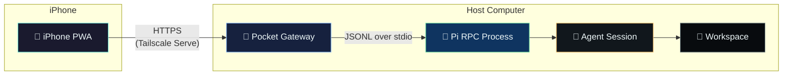

<div align="center">

# Pi Pocket Console

**iPhone-first remote control surface for the Pi coding agent**

[](LICENSE)
[](package.json)
[](tsconfig.json)
[](biome.json)
[](CONTRIBUTING.md)

<br />


<br />

**Turn your iPhone into a private remote control for AI-assisted coding.**

Pi Pocket Console runs beside [Pi](https://github.com/earendil-works/pi) on your computer and translates Pi's JSONL RPC stream into a touch-native Progressive Web App. It is a semantic controller—not an ANSI terminal mirror—so prompts, streaming responses, tool activity, models, queues, and shell runs remain usable on a phone while provider credentials stay on the host.

</div>

---

## Table of Contents

- [Features](#features)
- [Architecture](#architecture)
- [Prerequisites](#prerequisites)
- [Quick Start](#quick-start)
- [iPhone Setup](#iphone-setup)
- [CLI Reference](#cli-reference)
- [Security Model](#security-model)
- [Development](#development)
- [Testing](#testing)
- [Project Status](#project-status)
- [Contributing](#contributing)
- [License](#license)

---

## Features

| Area | What you can do |
|---|---|
| **Conversation** | Prompt, steer, follow-up, abort, and queue controls over Pi RPC |
| **Live Streaming** | Assistant text, thinking traces, tool activity, retries, compaction, and connection recovery |
| **Model Controls** | Discover and select models plus adjust thinking levels |
| **Session Management** | Live state hydration, message history, fork/clone/switch, new session |
| **Rich Input** | Image attachments (JPEG/PNG/WebP/GIF), extension confirmation/select/input/editor dialogs |
| **Shell Execution** | Streamed RPC `bash` execution—non-interactive, no PTY |
| **Multi-Instance** | One Pi RPC child per live instance, always in the configured workspace |
| **Single Controller** | Renewable lease prevents two devices from driving one instance simultaneously |
| **Offline Resilience** | App shell cached; local drafts preserved; commands never execute offline |
| **Credential Safety** | Provider credentials and Pi configuration remain on the host |

---

## Architecture



The gateway starts one Pi RPC child process per live instance. It correlates command responses, fans events into Server-Sent Events (SSE), and forwards extension UI responses. The HTTP layer adds security controls that Pi RPC does not provide: device pairing, CSRF protection, controller leases, workspace enforcement, and rate limits.

[Full architecture document →](docs/ARCHITECTURE.md)

---

## Prerequisites

- **Node.js** 22.19 or newer and npm
- **Pi** credentials and settings configured on the host
- A project directory the mobile controller may access
- **For remote use:** [Tailscale](https://tailscale.com/download) on the host and iPhone, signed in to the same tailnet

---

## Quick Start

```bash
# Install dependencies
npm ci

# Run checks and tests
npm run check
npm test

# Build for production
npm run build
```

---

## iPhone Setup

Tailscale Serve is the recommended HTTPS boundary. The gateway itself remains on loopback.

### 1. Start a Tailscale Serve proxy

```bash
tailscale serve 31415
```

Tailscale may ask you to enable HTTPS for the tailnet. Copy the exact `https://…ts.net` origin shown, and leave this command running.

### 2. Start Pi Pocket Console

```bash
# Development mode
npm run dev -- \
  --workspace /absolute/path/to/project \
  --origin https://your-host.your-tailnet.ts.net

# Or for production (after npm run build)
npm start -- \
  --workspace /absolute/path/to/project \
  --origin https://your-host.your-tailnet.ts.net
```

### 3. Open on iPhone

Open the HTTPS URL in Safari. Enter the six-digit pairing code printed by the gateway. The code expires after 10 minutes and works once.

### 4. Add to Home Screen

In Safari: **Share → Add to Home Screen → Open as Web App → Add**

> **⚠️ Keep this deployment private.** Do not use Tailscale Funnel, forward the port from a router, or expose the listener to the public internet.

### Local Preview

```bash
npm run dev -- \
  --workspace /absolute/path/to/project \
  --local-insecure
```

Open `http://127.0.0.1:31415`. This mode accepts insecure cookies only on loopback.

---

## CLI Reference

```text
pi-pocket --workspace <path> --origin <https-origin> [options]
pi-pocket --workspace <path> --local-insecure [options]
```

| Option | Purpose |
|---|---|
| `--workspace <path>` | Required fixed startup directory for every mobile Pi instance |
| `--origin <origin>` | Exact external HTTPS origin for same-origin and cookie security |
| `--host <host>` | Listener address (default: `127.0.0.1`) |
| `--port <port>` | Listener port (default: `31415`) |
| `--local-insecure` | Loopback-only HTTP preview (never use remotely) |
| `--tls-cert <path>` | PEM certificate for native HTTPS |
| `--tls-key <path>` | PEM private key for native HTTPS |

**Environment variable equivalents:** `PI_POCKET_WORKSPACE`, `PI_POCKET_ORIGIN`, `PI_POCKET_HOST`, `PI_POCKET_PORT`

---

## Security Model

> **Treat access to Pi Pocket Console like shell access to the host.**

- Pi runs with the gateway user's filesystem, process, network, and credential privileges
- The app is **not a sandbox**
- Pairing is a rate-limited one-time code (not a passkey)
- Device sessions last up to 12 hours in memory
- Gateway instances, leases, and conversation state are ephemeral
- The service worker caches only the public app shell—never API responses, transcripts, or credentials

[Complete security model →](SECURITY.md)

---

## Development

```bash
npm ci
npm run check    # Biome lint + format, TypeScript type check, client JS syntax check
npm test         # Run all tests with Node native test runner
npm run build    # Compile TypeScript to dist/
npm run dev      # Run in development mode with tsx
```

Automated checks cover gateway security and controller behavior. Physical device review is still required for the [iPhone acceptance matrix](docs/IPHONE-ACCEPTANCE.md).

---

## Testing

The test suite uses Node.js's built-in `node:test` runner — no external framework required.

```bash
npm test
```

Coverage is generated automatically by the Node test runner when supported. Tests cover:
- Server pairing, authentication, CSRF, rate limiting, command validation
- RPC process lifecycle, timeouts, chunk reassembly, error handling
- Model normalization and validation
- Client asset integrity and PWA correctness
- CLI startup and graceful shutdown

---

## Project Status

**Current version:** 0.1.0 — Beta

**Deliberate non-goals for v0.1:**
- Public-internet hosting
- Client-side provider keys
- ANSI TUI mirroring / raw PTY
- Interactive terminal apps (`vim`, `tmux`, etc.)
- A claim that Pi is sandboxed when it is not

**Roadmap:**
- [ ] GitHub Actions CI pipeline
- [ ] Docker deployment configuration
- [ ] Passkey-based pairing
- [ ] Configurable instance resource limits
- [ ] Native iOS app (future)

---

## Contributing

Contributions are welcome! Please read our [contributing guidelines](CONTRIBUTING.md) and [code of conduct](CODE_OF_CONDUCT.md) before starting.

- [Open an issue](https://github.com/calvinbrady/pi-pocket-console/issues/new)
- [Submit a pull request](https://github.com/calvinbrady/pi-pocket-console/compare)
- [View the architecture](docs/ARCHITECTURE.md)
- [Security disclosures](SECURITY.md)

---

## License

Pi Pocket Console is [MIT licensed](LICENSE). Copyright (c) 2026 Calvin Brady.

Pi is an upstream project with its own license and terms.

---

<div align="center">
  <sub>Built for the <a href="https://github.com/earendil-works/pi">Pi coding agent</a> · Designed for iPhone 16 Pro · Secure by default</sub>
</div>
