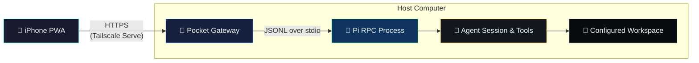
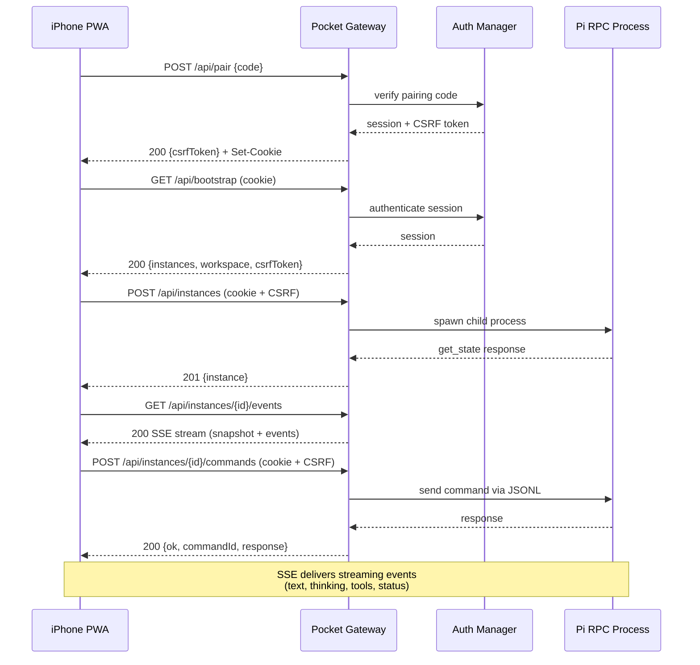

# Architecture

Pi Pocket Console is a standalone companion to [`earendil-works/pi`](https://github.com/earendil-works/pi). It does not patch or embed Pi's terminal UI.

## System Overview



## Request Flow



## Why the UI Is Semantic

Pi's TUI is designed for a terminal cell grid and hardware keyboard. Scaling that grid into a 402-point portrait viewport makes text, selection, tool activity, and shortcuts unnecessarily difficult.

The companion instead consumes Pi's typed RPC commands and events:

- `prompt`, `steer`, `follow-up`, `abort`, and queue updates
- Streamed assistant text, thinking, tools, retries, and compaction
- Model and thinking-level discovery and selection
- Session state, messages, entries, tree, statistics, clone, and new session
- Image prompts and extension input dialogs
- RPC shell execution and streamed output

The PWA renders those events as touch-native controls while Pi and all provider credentials remain on the host.

## Process Boundaries

```
┌─────────────────────────────────────────────────────┐
│                  Pocket Gateway                      │
│                                                      │
│  ┌──────────┐  ┌──────────────┐  ┌───────────────┐  │
│  │   Auth    │  │  Instance    │  │  Controller    │  │
│  │  Manager  │  │   Manager    │  │    Leases      │  │
│  └──────────┘  └──────┬───────┘  └───────────────┘  │
│                        │                             │
│  ┌─────────────────────▼──────────────────────────┐  │
│  │              Stream Hub (SSE)                   │  │
│  └────────────────────────────────────────────────┘  │
│                                                      │
│  ┌────────────────────────────────────────────────┐  │
│  │            HTTP Server + Router                 │  │
│  │  - Security headers   - Rate limiting           │  │
│  │  - CSRF enforcement   - Static serving          │  │
│  │  - Origin validation  - Path traversal guard    │  │
│  └────────────────────────────────────────────────┘  │
└──────────────────────┬──────────────────────────────┘
                       │
              JSONL over stdio
                       │
┌──────────────────────▼──────────────────────────────┐
│              Pi RPC Child Process                    │
│  Spawned per instance, configured workspace as CWD   │
└─────────────────────────────────────────────────────┘
```

The gateway starts one Pi RPC child process per live instance, always with the configured workspace as its working directory. It correlates command responses, fans events into Server-Sent Events, and forwards extension UI responses.

The HTTP layer adds controls that Pi RPC itself does not provide:

- Device pairing and session cookies
- CSRF and same-origin checks
- A single-controller lease
- Workspace-root enforcement
- Request and rate limits
- PWA asset delivery and security headers

## Key Components

| Component | File | Responsibility |
|---|---|---|
| `AuthManager` | `src/auth.ts` | Pairing codes, session tokens, CSRF tokens, rate-limited attempts |
| `PocketRpcProcess` | `src/rpc-process.ts` | Spawns Pi RPC child, JSONL communication, timeout handling |
| `InstanceManager` | `src/instance-manager.ts` | Instance lifecycle, status tracking, listener fan-out |
| `StreamHub` | `src/server.ts` | SSE stream management, history replay, keepalive, backpressure |
| `ControllerLeases` | `src/controller-lease.ts` | Single-controller lease with TTL |
| CLI entry | `src/cli.ts` | Argument parsing, TLS loading, signal handling |

## Deliberate Non-Goals for v0.1

- Public-internet hosting
- Client-side provider keys
- Recreating the removed Pi web UI
- ANSI TUI mirroring
- Interactive PTY applications such as `vim` or `tmux`
- A claim that Pi is sandboxed when it is not
