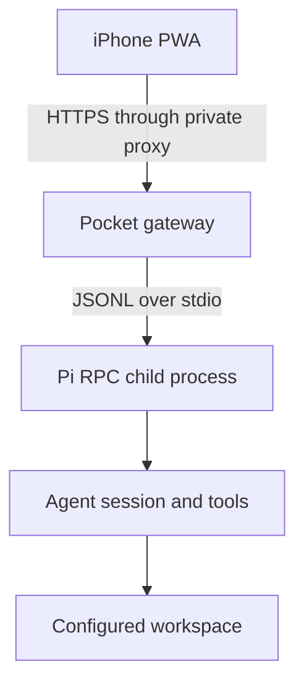

# Architecture

Pi Pocket Console is a standalone companion to
[`earendil-works/pi`](https://github.com/earendil-works/pi). It does not patch
or embed Pi's terminal UI.

## Why the UI is semantic

Pi's TUI is designed for a terminal cell grid and hardware keyboard. Scaling
that grid into a 402-point portrait viewport makes text, selection, tool
activity, and shortcuts unnecessarily difficult.

The companion instead consumes Pi's typed RPC commands and events:

- prompt, steer, follow-up, abort, and queue updates;
- streamed assistant text, thinking, tools, retries, and compaction;
- model and thinking-level discovery and selection;
- session state, messages, entries, tree, statistics, clone, and new session;
- image prompts and extension input dialogs;
- RPC shell execution and streamed output.

The PWA renders those events as touch-native controls while Pi and all provider
credentials remain on the host.

## Process boundaries

The gateway starts one Pi RPC child process per live instance, always with the
configured workspace as its working directory. It correlates command
responses, fans events into Server-Sent Events, and forwards extension UI
responses.

The HTTP layer adds controls that Pi RPC itself does not provide:

- device pairing and session cookies;
- CSRF and same-origin checks;
- a single-controller lease;
- workspace-root enforcement;
- request and rate limits;
- a configurable live-instance capacity cap (default 1), enforced atomically in
  the instance manager and exposed through the bootstrap response;
- PWA asset delivery and security headers.

## Deliberate non-goals for v0.1

- Public-internet hosting.
- Client-side provider keys.
- Recreating the removed Pi web UI.
- ANSI TUI mirroring.
- Interactive PTY applications such as `vim` or `tmux`.
- A claim that Pi is sandboxed when it is not.
